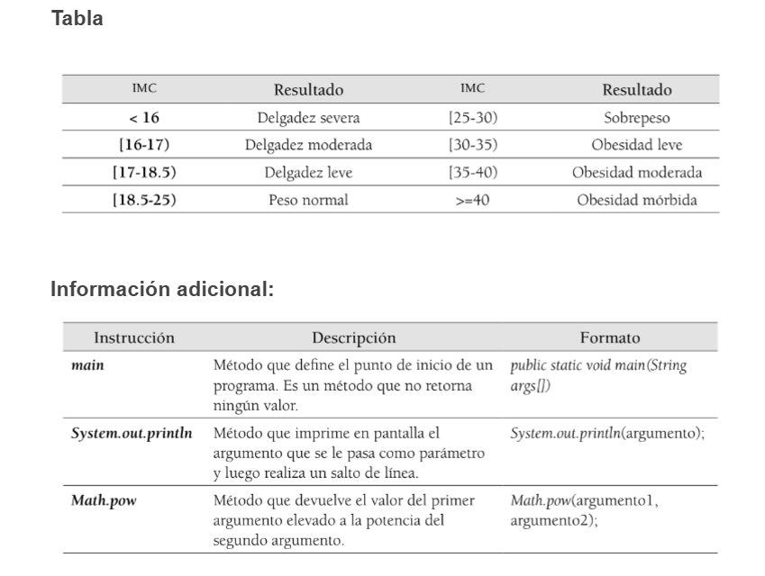

## Java - Índice de masa corporal

# Exercise: BMI (Body mass index) (en)
This is an exercise created to practice Java fundamentals

## Instructions
A console program is required to calculate a person's body mass index. The application will request the person's weight (in kilograms) and height (in meters). The body mass index (BMI) is calculated using the following formula:

> **BMI = weight / height2**

Then, from the BMI obtained, it's possible to calculate whether a person has a normal weight, is underweight, is overweight, or is obese. To generate these results, the calculated BMI must be within the ranges in the table.

### BMI results table

| BMI        | Results 
| ---------- | ------------- |
| < 16       | Severe thinness  |
| 16 - 17    | Moderate thinness |
| 17 - 18,5  | Mild thinness  |
| 18,5 - 25  | Normal weight  |
| 25 - 30    | Overweight |
| 30 - 35    | Mild obesity |
| 35 - 40    | Moderate obesity  |
| >= 40      | Morbid obesity |

 
 

 
 

